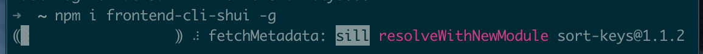
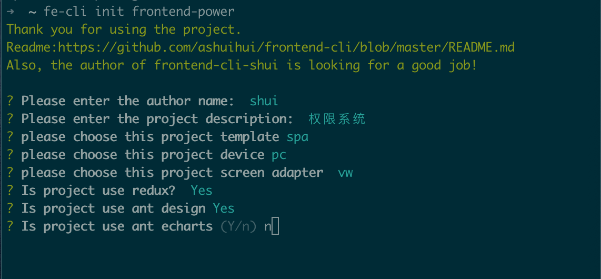

# 腾讯云开发-个人权限系统-前端
## 前端
- 首先全局安装我的个人前端脚手架：```npm install -g frontend-cli-shui```

这个脚手架我刚开始建设，现在还只有单页面的模板，```npm```已经发布，欢迎使用。<br/>
然后用这个脚手架根据配置快速起一个```react```项目模版：```fe-cli init frontend-power```


- 然后用ant design 组件简单写个登录页、表格页、表单页


