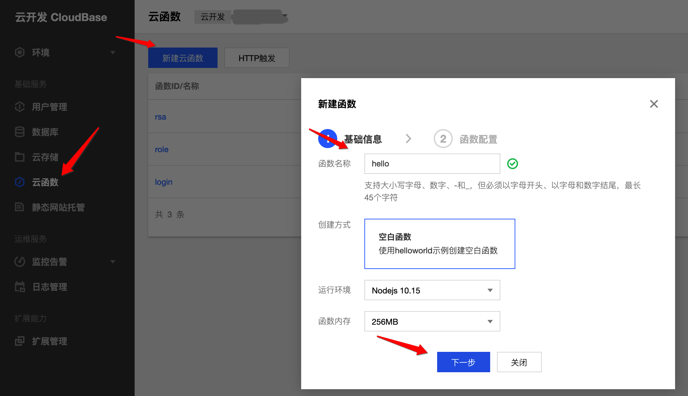
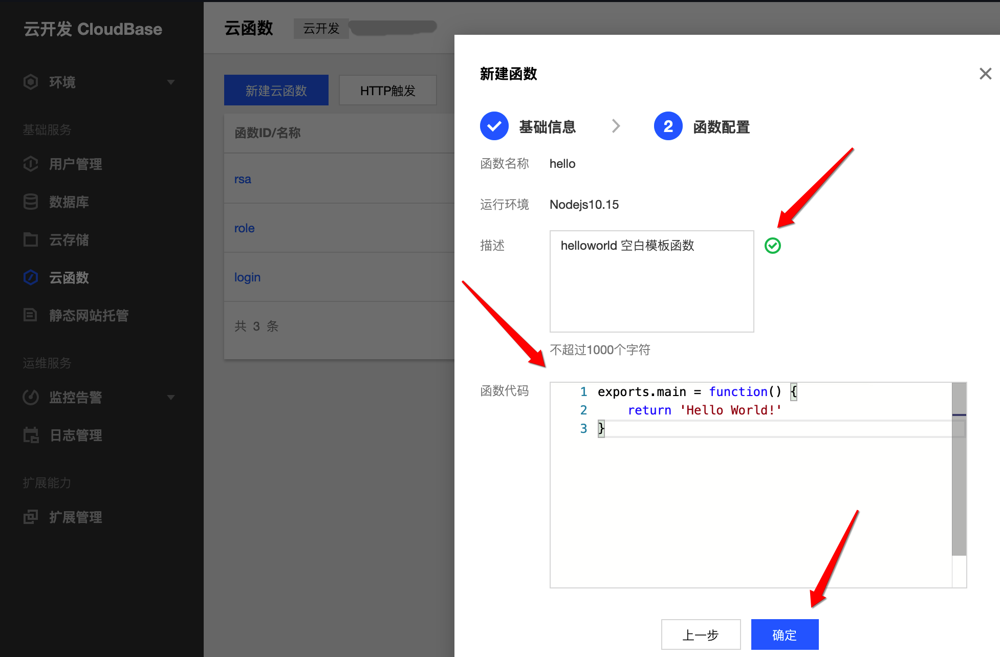

# 云函数(接口开发)
#### [官方文档](https://cloud.tencent.com/document/product/876/41762)
云函数就是函数，托管给云平台，使用云平台计算资源去执行。
## 新建发布云函数
- 可以用node、python、php开发
- 本文采用的是node
- 可以在云平台提供的控制台里新建函数，也可以通过官方提供的脚手架新建发布函数
- 来个```Hello World!```,就是这么简单



## 调用方式
- 使用腾讯提供的stk 在客户端直接调用云函数，这样的触发方式安全性较高
- 使用http触发，和传统接口无二别，但是这种触发方式鉴权需自己把控，避免流量攻击。每次调用都是白花花的银子。
- 也可以设置定时器，定时触发
- 具体看官方文档