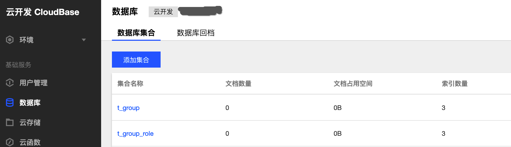

# 腾讯云开发-个人权限系统-数据库设计
#### [官方文档](https://cloud.tencent.com/document/product/876/19369)
云开发套餐提供的是 NoSQL 数据库，底层是MongoDB。<br/>
如果你不了解，可以简单的阅读下[wiki](https://zh.wikipedia.org/zh-cn/MongoDB)<br/>
## 设计
nosql是文档数据，扩展非常容易简单。但一个项目的地基就是数据库的数据设计，还是需要设计下er图。

这里我偷懒了，图上没字段，但是我写了sql建表文件。<br/>
腾讯云提供控制台手动建表，sql文件可以不写，写了有利于后续开发人员对数据库的维护和扩展。贴两个表：
```sql

-- 用户表
CREATE TABLE `t_user`(
    `id` bigint(20) UNSIGNED AUTO_INCREMENT NOT NULL COMMENT '主键,自增id',
    `password` VARCHAR(100) NOT NULL COMMENT '密码',
    `name` VARCHAR(50) NOT NULL COMMENT '用户名称',
    `real_name` VARCHAR(50) NOT NULL DEFAULT '' COMMENT '真实姓名',
    `phone` VARCHAR(50) NOT NULL DEFAULT '' COMMENT '手机号',
    `email` VARCHAR(50) NOT NULL DEFAULT '' COMMENT '邮箱',
    `remark` VARCHAR(255) NOT NULL DEFAULT '' COMMENT '备注',
    `yn` tinyint(2) NOT NULL DEFAULT 1 COMMENT '有效位 1:有效 0:无效',
    `creator` VARCHAR(50) NOT NULL DEFAULT '' COMMENT '创建者',
    `created` TIMESTAMP NOT NULL DEFAULT CURRENT_TIMESTAMP COMMENT '创建时间',
    `modifier` VARCHAR(50) NOT NULL DEFAULT '' COMMENT '修改人',
    `modified` TIMESTAMP NOT NULL DEFAULT CURRENT_TIMESTAMP ON UPDATE CURRENT_TIMESTAMP COMMENT '修改时间',
    PRIMARY KEY (`id`),
    UNIQUE INDEX `uniq_01` (`phone`, `yn`)
) ENGINE = INNODB DEFAULT CHARSET = utf8mb4 COMMENT = '用户表';

-- 角色表
CREATE TABLE `t_role`(
    `id` bigint(20) UNSIGNED AUTO_INCREMENT NOT NULL COMMENT '主键id',
    `system_id` bigint(20) UNSIGNED NOT NULL COMMENT '系统id',
    `name` VARCHAR(50) NOT NULL COMMENT '角色名称',
    `remark` VARCHAR(255) NOT NULL DEFAULT '' COMMENT '备注',
    `yn` tinyint(2) NOT NULL DEFAULT 1 COMMENT '有效位 1:有效 0:无效',
    `creator` VARCHAR(50) NOT NULL DEFAULT '' COMMENT '创建者',
    `created` TIMESTAMP NOT NULL DEFAULT CURRENT_TIMESTAMP COMMENT '创建时间',
    `modifier` VARCHAR(50) NOT NULL DEFAULT '' COMMENT '修改人',
    `modified` TIMESTAMP NOT NULL DEFAULT CURRENT_TIMESTAMP ON UPDATE CURRENT_TIMESTAMP COMMENT '修改时间',
    PRIMARY KEY (`id`),
    UNIQUE INDEX `uniq_01` (`system_id`, `name`, `yn`)
) ENGINE = INNODB DEFAULT CHARSET = utf8mb4 COMMENT = '角色表';
```

## 建表
#### [官方文档](https://cloud.tencent.com/document/product/876/19371)
官方文档写的很清楚了，我简单写下流程
- 首先进入云开发的控制台
- 左边菜单栏选择数据库
- 点击蓝色按钮"添加集合"
- 模态框输入集合名字确认
- 刷新后表里有该集合名
- 点击集合名进入集合管理，可以管理文档和索引
截个小图。


