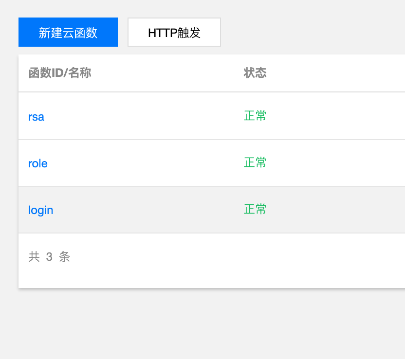

# 鉴权
#### [官方文档](https://cloud.tencent.com/document/product/876/41728)
用户身份鉴权（/验证）后，才有权去调用我们的接口（/云函数），才能获取到数据库里的数据；也便于用户访问记录的收集和分析。
### 鉴权有很多种
- 微信授权登录
- 匿名登录
- 微信小程序登录
- 自定义登录
#### 实现鉴权
企业一般是微信授权登录，绑定自家用户系统。<br/>
个人嘛，选择自定义登录授权。微信授权和小程序授权有太多手续；匿名太不安全，也费流量钱。
- 写个登录云函数,用rsa加密，token pwt实现身份验证

```javascript
import { getToken, IParams } from './services/login';
import baseModel from './models/index';
module.exports.main = async (event, context) => {
	if (!event || !event.queryStringParameters) {
		return baseModel.errorParams;
	}
	let params = {
		phone: event.queryStringParameters.phone || '',
		password: event.queryStringParameters.password || '',
	};
	console.log('params=>', params);
	if (!params.phone || !params.password) {
		return baseModel.errorParams;
	}
	let result = null;
	await getToken(params as IParams)
		.then((res) => {
			result = res;
		})
		.catch((err) => {
			result = err;
		});
	return result;
};

```

- 写个发布脚本，可以快速发布  

- 控制台看下函数列表,已经有了

- 控制台直接提供了简单的测试工具，测试一下,ok的。

- 配置下函数用http触发，设置下路由

- 前端可以通过sdk调用、也可以用http。

#### 数据返回的细节
- 返回数据设计如下：
```
{
    code:number
    data:object
    msg:string
}
```
code：标识符，成功、失败、失败类型<br/>
data：具体业务的返回数据<br/>
msg：字符串消息，eg：失败原因
- 可以看到我写了个```baseModel```，放了最基本的返回，像参数错误、数据库错误、成功/失败封装方法等等，偷懒复用。
- ```getToken```方法就是```service```层的登录鉴权服务，根据参数返回用户的```token```和```ticket```。
- ```ticket```生成参考[官方文档](https://cloud.tencent.com/document/product/876/41731)
- ```token```生成直接用[jsonwebtoken](https://www.npmjs.com/package/jsonwebtoken)
